# Guía de Mantenimiento: Backup, Recuperación y Actualización de Nextcloud

En esta guía práctica se detallan los procedimientos esenciales para la administración del servidor Nextcloud desplegado con Docker: cómo realizar una **copia de seguridad consistente**, los pasos críticos para una **recuperación ante desastres** y el procedimiento para **actualizar la imagen de Nextcloud** a una versión más reciente.

---

## 1. Procedimiento de Backup (Copia de Seguridad)

Para garantizar que el respaldo sea **consistente** (evitando que los usuarios modifiquen archivos mientras se copian), se debe activar previamente el modo de mantenimiento.

### Paso 1: Activar el Modo de Mantenimiento
Congela las operaciones de escritura y bloquea el acceso temporal de los usuarios:
```bash
docker compose exec --user www-data app php occ maintenance:mode --on
```
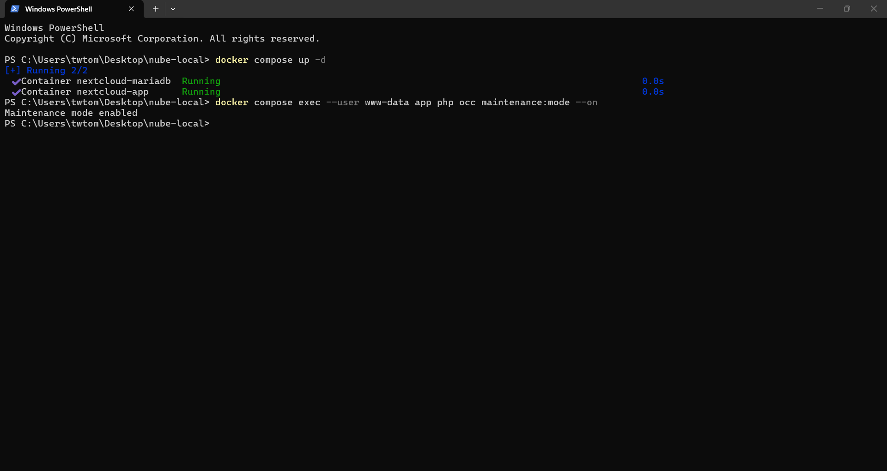

Al intentar ingresar desde el navegador web, Nextcloud informará que la instancia se encuentra en mantenimiento:

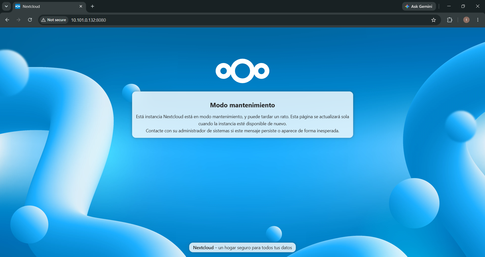

---

### Paso 2: Respaldar la Base de Datos (MariaDB)
Exporta toda la información relacional (cuentas de usuario, metadatos, comparticiones) a un archivo `.sql`:
```bash
docker compose exec db mysqldump -u nextcloud -pNextcloudDbPass123 nextcloud > backup_database.sql
```
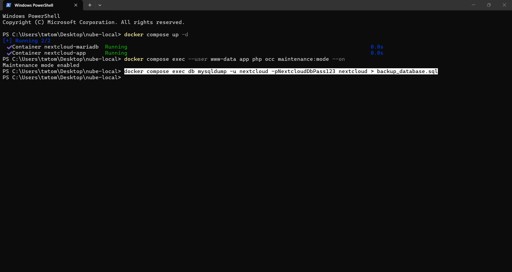

Verificar que el archivo `backup_database.sql` se haya generado correctamente en la carpeta del proyecto:

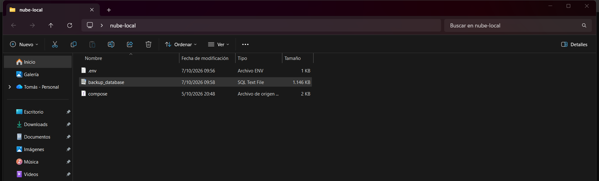

---

### Paso 3: Respaldar los Archivos y la Configuración
Copia los parámetros críticos del sistema (`config`) y los datos de los usuarios (`data`) desde el contenedor hacia la computadora anfitriona:
```bash
docker cp nextcloud-app:/var/www/html/config ./backup_config
docker cp nextcloud-app:/var/www/html/data ./backup_data
```
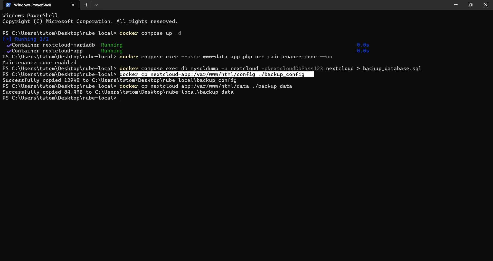

Comprobar que se crearon las carpetas `backup_config` y `backup_data`:

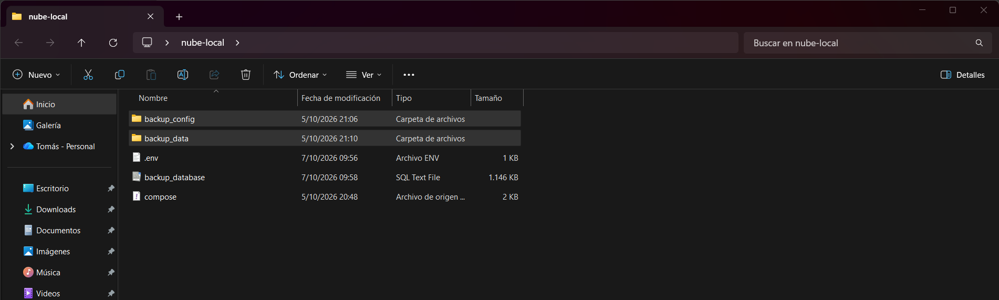

---

### Paso 4: Desactivar el Modo de Mantenimiento
Reanuda la operación normal del servidor para que los usuarios puedan continuar trabajando:
```bash
docker compose exec --user www-data app php occ maintenance:mode --off
```
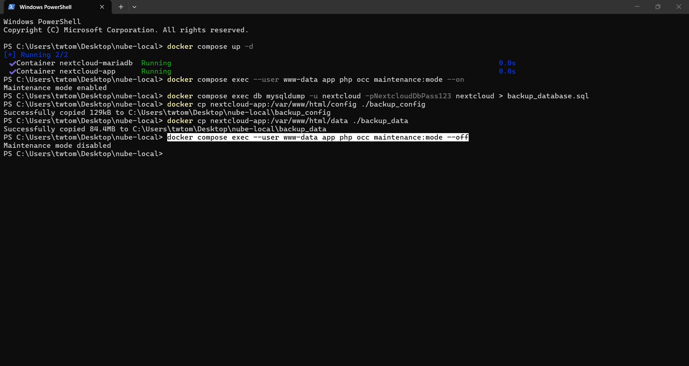

Verificar que los contenedores estén activos:

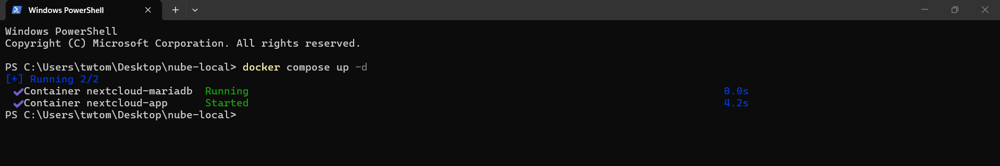

Y comprobar que la pantalla de inicio de sesión vuelva a estar accesible:


---

## 2. Lo Esencial para la Recuperación (Restauración)

En caso de fallo catastrófico, pérdida de datos o migración a una nueva máquina, la restauración requiere obligatoriamente la **tríada completa**:

```
                 ┌──────────────────────────────────────┐
                 │     TRÍADA PARA LA RECUPERACIÓN      │
                 └──────────────────┬───────────────────┘
                                    │
         ┌──────────────────────────┼──────────────────────────┐
         ▼                          ▼                          ▼
┌──────────────────┐       ┌──────────────────┐       ┌──────────────────┐
│  Base de Datos   │       │ Archivos Datos   │       │  Configuración   │
│ (`.sql` limpio)  │       │   (`data/`)      │       │ (`config.php`)   │
└──────────────────┘       └──────────────────┘       └──────────────────┘
```

### Paso 1: Desplegar los contenedores base y activar mantenimiento
En la nueva máquina o entorno limpio, desplegar los contenedores y activar inmediatamente el modo de mantenimiento:
```bash
docker compose up -d
docker compose exec --user www-data app php occ maintenance:mode --on
```
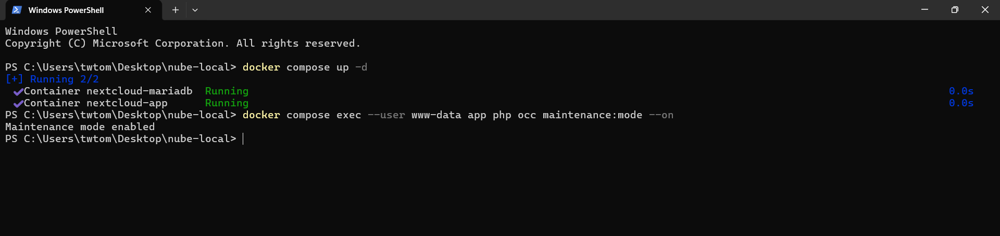

---

### Paso 2: Restaurar la Base de Datos
Importar el archivo `backup_database.sql` dentro del contenedor de MariaDB:

* **En PowerShell (Windows):**
  ```powershell
  cat backup_database.sql | docker compose exec -T db mysql -u nextcloud -pNextcloudDbPass123 nextcloud
  ```
* **En Linux / Bash:**
  ```bash
  docker compose exec -T db mysql -u nextcloud -pNextcloudDbPass123 nextcloud < backup_database.sql
  ```

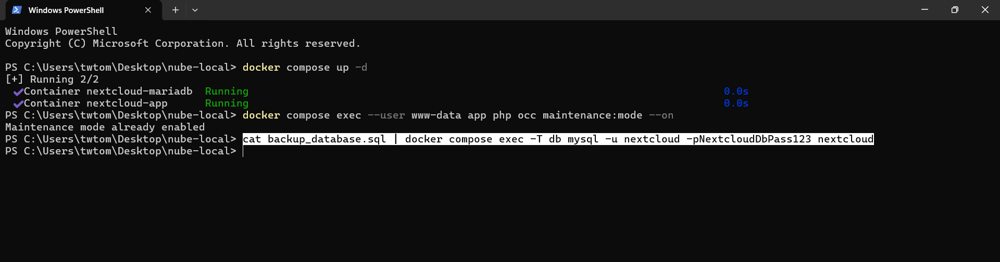

---

### Paso 3: Restaurar las carpetas `config/` y `data/`
Copiar los directorios respaldados de vuelta hacia el interior del contenedor:
```bash
docker cp ./backup_config/. nextcloud-app:/var/www/html/config/
docker cp ./backup_data/. nextcloud-app:/var/www/html/data/
```
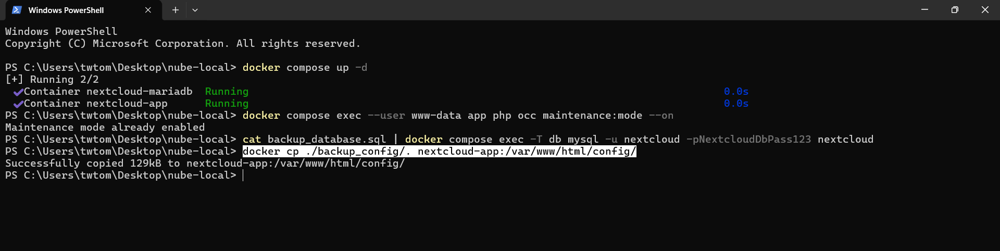

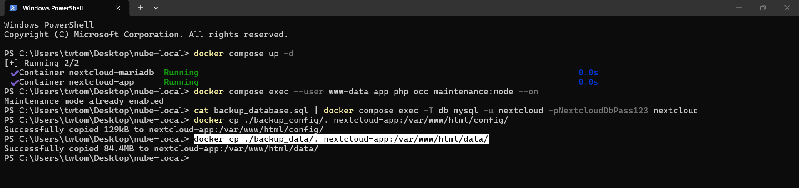

---

### Paso 4: Ajustar permisos y regenerar la huella digital (Fingerprint)
Asegurar los permisos del servidor web (`www-data`) y sincronizar la huella de datos para reconciliar los clientes móviles/escritorio:
```bash
docker compose exec --user root app chown -R www-data:www-data /var/www/html/config /var/www/html/data
docker compose exec --user www-data app php occ maintenance:data-fingerprint
```
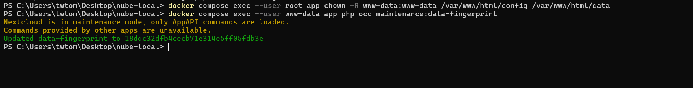

---

### Paso 5: Desactivar mantenimiento y validar la recuperación
Reactivar el servidor:
```bash
docker compose exec --user www-data app php occ maintenance:mode --off
```
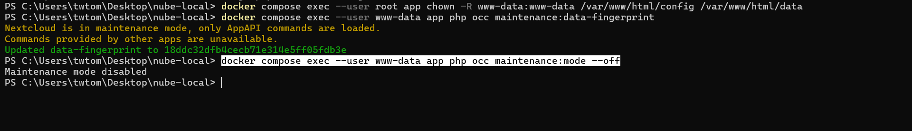

Ingresar a `http://TU_IP:8080` y comprobar que todos los usuarios, contraseñas y archivos han sido restaurados con éxito:

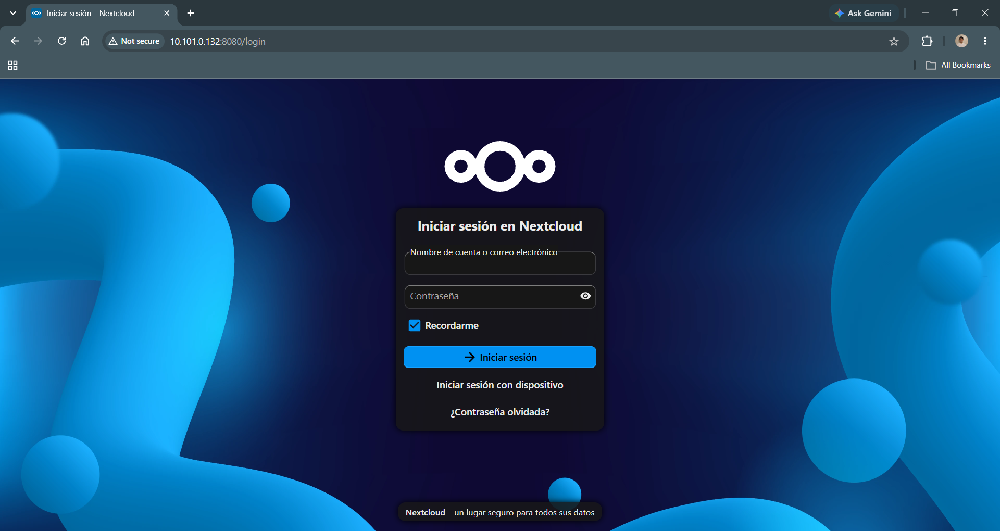

---

## 3. Procedimiento para Actualizar la Imagen de Nextcloud

Gracias a que los datos y la base de datos residen en **volúmenes persistentes de Docker**, actualizar Nextcloud es un proceso ágil y seguro:

### Paso 1: Descargar la versión más reciente de la imagen
Descargar las nuevas imágenes oficiales definidas en `compose.yaml`:
```bash
docker compose pull
```
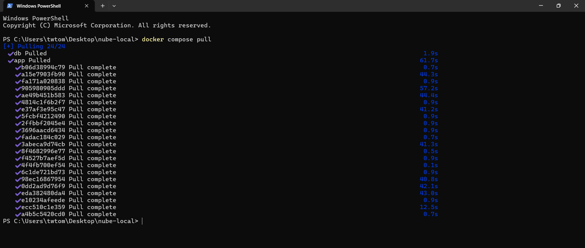

---

### Paso 2: Recrear los contenedores con la nueva versión
Docker detendrá los contenedores anteriores y levantará los nuevos montando automáticamente los mismos volúmenes de datos existentes:
```bash
docker compose up -d
```
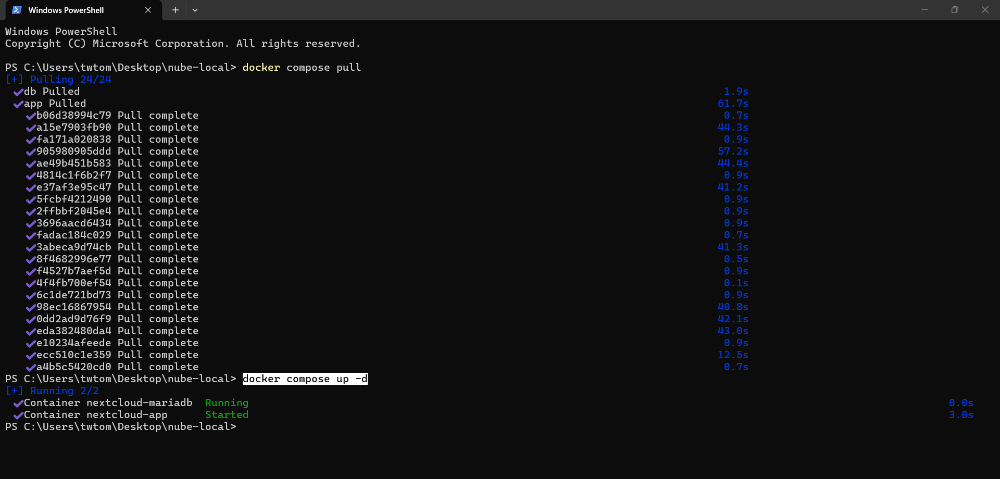

---

### Paso 3: Aplicar migraciones internas de Nextcloud
Nextcloud ejecutará las actualizaciones de esquema necesarias:
```bash
docker compose exec --user www-data app php occ upgrade
```
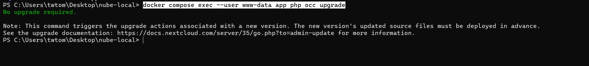

---

## 📌 Resumen de Comandos Rápidos

| Tarea | Comando principal |
| :--- | :--- |
| **Activar mantenimiento** | `docker compose exec --user www-data app php occ maintenance:mode --on` |
| **Backup Base de Datos** | `docker compose exec db mysqldump -u nextcloud -pNextcloudDbPass123 nextcloud > backup.sql` |
| **Copiar datos/config afuera** | `docker cp nextcloud-app:/var/www/html/data ./backup_data` |
| **Restaurar BD (PowerShell)** | `cat backup.sql \| docker compose exec -T db mysql -u nextcloud -pNextcloudDbPass123 nextcloud` |
| **Desactivar mantenimiento** | `docker compose exec --user www-data app php occ maintenance:mode --off` |
| **Actualizar imagen** | `docker compose pull && docker compose up -d && docker compose exec --user www-data app php occ upgrade` |
