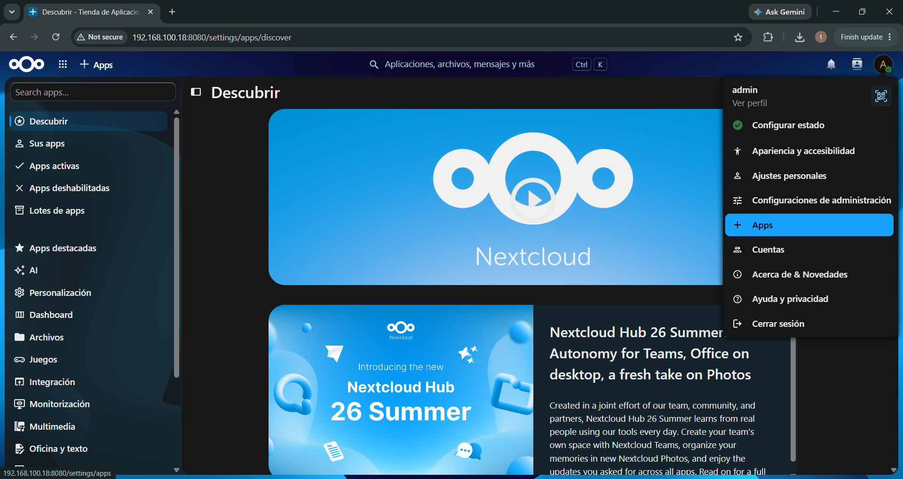
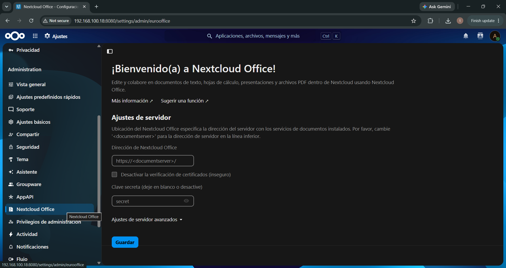
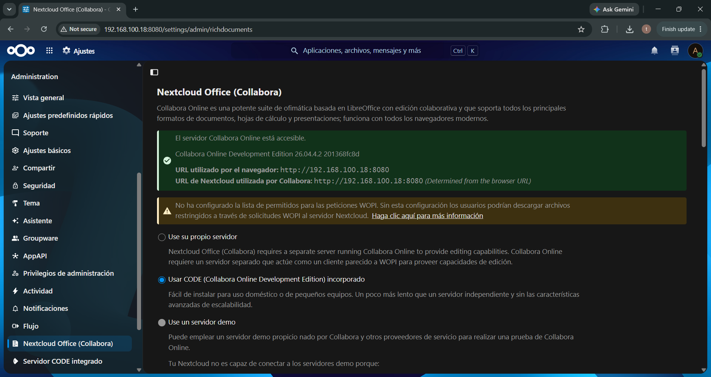
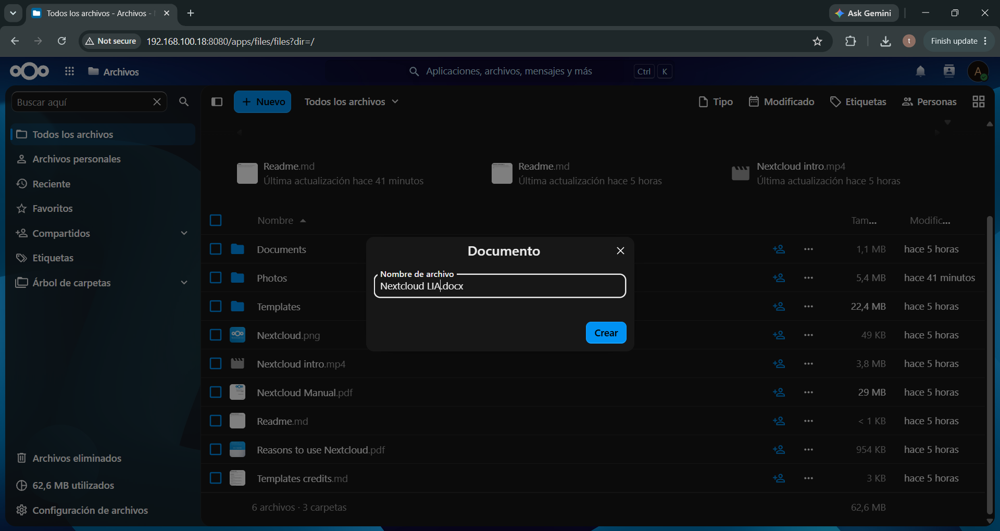
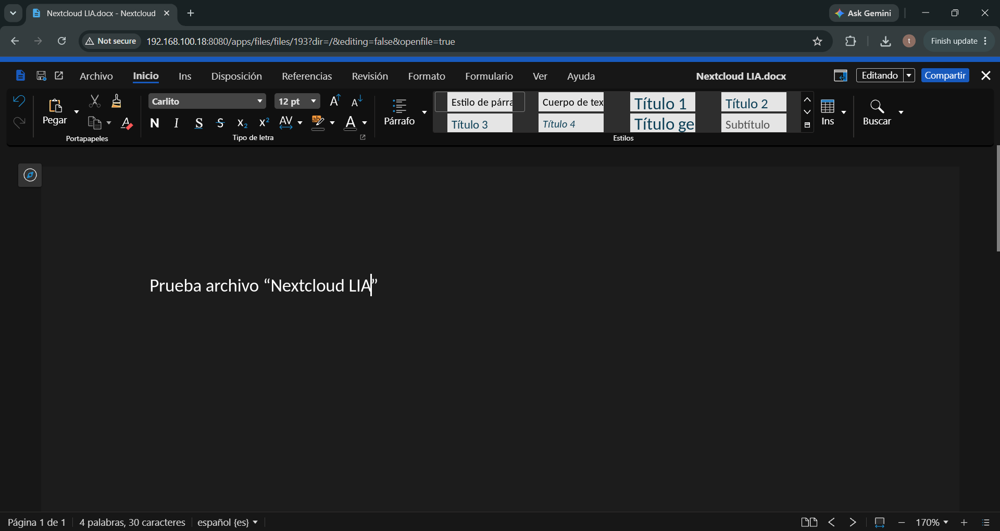

# Suite ofimática colaborativa: Nextcloud Office + Collabora Online Built-in CODE Server

En esta guía configuraremos la suite ofimática integrada en **Nextcloud** utilizando **Nextcloud Office** y el motor **Collabora Online - Built-in CODE Server**. Esta solución permite crear, visualizar y editar documentos de texto, hojas de cálculo y presentaciones de manera colaborativa en tiempo real directamente desde el navegador web o la aplicación móvil, sin necesidad de desplegar contenedores adicionales ni configuraciones complejas de red.

---

## ¿Por qué utilizar el Servidor CODE Integrado (*Built-in*)?

* **Sin configuración de infraestructura externa:** No requiere crear contenedores Docker dedicados para Collabora ni gestionar proxies inversos o certificados SSL adicionales.
* **Despliegue rápido:** Se instala y gestiona directamente desde la tienda oficial de aplicaciones de Nextcloud con solo unos clics.
* **Ideal para entornos de capacitación y redes locales:** Permite que cualquier usuario conectado al servidor (desde PC o dispositivos móviles) utilice la suite ofimática sin instalar nada en sus equipos locales.

---

## Paso 1: Acceder a la Gestión de Aplicaciones

1. Iniciar sesión en Nextcloud con la cuenta de **Administrador**.
2. En la esquina superior derecha, hacer clic en el avatar del usuario o ícono de perfil.
3. En el menú desplegable, seleccionar la opción **+ Aplicaciones** (*Apps*).

---

## Paso 2: Buscar e Instalar las Aplicaciones Requeridas

Para habilitar la edición de documentos se requieren **dos componentes complementarios**:

1. **El motor de procesamiento y renderizado:**
   * Buscar en la tienda **Collabora Online - Built-in CODE Server** (o buscar `CODE`).
   * Hacer clic en **Descargar y activar** (*Download and enable*).
   * > **Nota sobre la descarga:** Esta aplicación pesa entre 300 MB y 500 MB (incluye el motor completo de Collabora/LibreOffice), por lo que puede demorar un par de minutos en descargarse e instalarse.

2. **La interfaz de usuario del editor (¡Atención a la app correcta!):**
   * En el buscador de aplicaciones, buscar **`richdocuments`** o **`Collabora`**.
   * Localizar e instalar la aplicación oficial **Nextcloud Office** desarrollada por **Nextcloud GmbH / Collabora Productivity** (identificador técnico `richdocuments`).
   * > ⚠️ **Detalle importante:** Evitar instalar conectores de terceros como *Ascensio System SIA / EuroOffice*, ya que corresponden a OnlyOffice y no reconocen el servidor CODE integrado. Debemos instalar la versión oficial de **Nextcloud GmbH / Collabora**.
   * Hacer clic en **Descargar y activar** (*Download and enable*).

---

## Paso 3: Acceder a la Configuración de Administración

1. Una vez finalizada la instalación de ambas aplicaciones, hacer clic nuevamente en el menú de usuario (esquina superior derecha).
2. Seleccionar **Ajustes de administración** (*Administration settings*).
3. En el panel lateral izquierdo, desplazarse hasta la sección **Administración** y seleccionar **Office** (o **Nextcloud Office**).

---

## Paso 4: Configurar el Servidor CODE Integrado

1. En la pantalla de configuración de Nextcloud Office, seleccionar la opción:
   * **"Utilizar el servidor CODE integrado"** (*Use the built-in CODE server (reports/installs CODE app)*).
2. Hacer clic en el botón **Guardar** (*Save*).
3. Verificar que aparezca un indicador de estado verde que confirme la conexión correcta con el servidor interno de Collabora.

---

## Paso 5: Validar la Creación y Edición de Documentos

1. Ir a la sección principal de **Archivos** de Nextcloud (ícono de carpeta en la barra superior).
2. Hacer clic en el botón **+** (Nuevo) y seleccionar crear un **Nuevo documento de texto**, **Hoja de cálculo** o **Presentación**.

3. Asignar un nombre al archivo y abrirlo.
4. Comprobar que el editor de Collabora cargue correctamente dentro del navegador y permita editar el contenido en tiempo real.

---

## 📌 Consideraciones Importantes y Solución de Problemas

### 1. Gestión transparente para clientes y móviles
Una vez configurado en el servidor, **los clientes web, de escritorio y las aplicaciones móviles oficiales de Nextcloud podrán abrir y editar documentos sin requerir ninguna instalación adicional por parte de los usuarios**. El servidor centraliza todo el procesamiento.

### 2. ¿Qué ocurre si cambia la IP del servidor en la red local?
Si la computadora servidora cambia de dirección IP (por ejemplo, al cambiar de red Wi-Fi o reiniciarse el router):
1. Actualizar la variable `HOST_IP` en el archivo `.env` del servidor y ejecutar `docker compose up -d` (según se detalla en la guía de instalación).
2. Ingresar a Nextcloud como Administrador.
3. Ir a **Ajustes de administración -> Office**, volver a seleccionar la opción del servidor CODE integrado y hacer clic en **Guardar** para refrescar los dominios y la URL de enlace.
